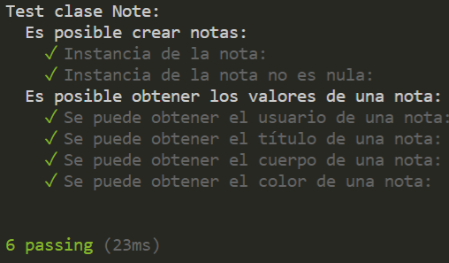

# DESARROLLO DE SISTEMAS INFORMÁTICOS

<br/><br/>

## Práctica 10 - Cliente y servidor para una aplicación de procesamiento de notas de texto

<br/><br/>

### Óscar Cigala Álvarez (alu0101038230@ull.edu.es)

<br/><br/>

### Índice:

1. [Introducción y objetivos.](#id1)
2. [Desarrollo.](#id2)
  
      2.1. [Ficheros note-app.ts y commands.ts.](#id21)

      2.2. [Fichero server.ts.](#id22)

      2.3. [Fichero client.ts.](#id23)

      2.4. [Ficheros types.ts y tests.](#id24)

4. [Dificultades.](#id3)
5. [Conclusión.](#id4)
6. [Referencias.](#id5)

<br/><br/>

## 1. Introducción y objetivos. <a name="id1"></a>

En esta práctica toca resolver un problema que nos es familiar, ya que es el ejercicio de las notas que hemos ido mejorando desde hace dos prácticas. Ahora, tendremos que implementar un cliente y un servidor haciendo uso de **sockets** para permitir que un usuario desde ese cliente pueda añadir, borrar, modificar, ver y leer las notas.

<br/><br/>

## 2. Desarrollo. <a name="id2"></a>
### 2.1. Ficheros note-app.ts y commands.ts. <a name="id21"></a>

Para comenzar, voy a mostrar los ficheros `note-app.ts`, en el cual se encuentra la clase `Note` encargada de crear las notas, y el fichero `commands.ts` encargado de recibir los comandos y comprobar que el tipo, el nombre y la cantidad de los argumentos recibidos en el cliente son los correctos. Ambos ficheros prácticamente son idénticos a los que hice en la práctica 8, a diferencia de que ahora en el manejador de cada comando no realizo las operaciones de borrado, modificado... si no que esto se hace en `server.ts` por lo tanto, simplemente me voy a limitar a mostrar el código de cada uno:

**note.app.ts:**
```Typescript
 export class Note {

  public user: string;
  public title: string;
  public body: string;
  public color: string;

  constructor(user: string, title: string, body: string, color: string) {
    this.user = user;
    this.title = title;
    this.body = body;
    this.color = color;
  }

  public write():string {
    return '{\n\"title\": \"' + this.title + '\",\n\"body\": \"'+ this.body +
    '\",\n\"color\": \"' + this.color + '\"\n}';
  }
}
```

**commands.ts**
```Typescript
import * as yargs from 'yargs';
import { client } from './client';
import { RequestType } from "./types";


const cliente = new client(60300);
let req: RequestType = {};

yargs.command({
  command: 'add',
  describe: 'Add a new note',
  builder: {
    user: {
      describe: 'User name',
      demandOption: true,
      type: 'string',
    },
    title: {
      describe: 'Note title',
      demandOption: true,
      type: 'string',
    },
    body: {
      describe: 'Body of the note',
      demandOption: true,
      type: 'string',
    },
    color: {
      describe: 'Color of the note',
      demandOption: true,
      type: 'string',
    },
  },
  handler(argv) {
    if ((typeof argv.user === 'string') && (typeof argv.title === 'string') &&
      (typeof argv.body === 'string') && (typeof argv.color === 'string'))
      req = {type: 'add', user: argv.user, title: argv.title, body: argv.body, color: argv.color};
  },
});

//...

yargs.command({
  command: 'modify',
  describe: 'Modify a note',
  builder: {
    user: {
      describe: 'User name',
      demandOption: true,
      type: 'string',
    },
    title: {
      describe: 'Note title',
      demandOption: true,
      type: 'string',
    },
    body: {
      describe: 'Body of the note',
      demandOption: true,
      type: 'string',
    },
    color: {
      describe: 'Color of the note',
      demandOption: true,
      type: 'string',
    },
  },
  handler(argv) {
    if ((typeof argv.user === 'string') && (typeof argv.title === 'string') &&
      (typeof argv.body === 'string') && (typeof argv.color === 'string'))
      req = {type: 'modify', user: argv.user, title: argv.title, body: argv.body, color: argv.color};
  },
}).parse();

cliente.request(req);
```

<br/><br/>

### 2.2. Fichero server.ts. <a name="id22"></a>

El tercer fichero que voy a explicar es `server.ts`, este método contiene la clase `server`. Un servidor expone un servicio a partir de un puerto, al cual se conecta el cliente, en este caso, hemos empleado el puerto **60300**. Lo primero que hago es crear el servidor, esto se hace mediante el método `createServer()`, el cual recibe como parámetro un manejador y devuelve un objeto **Server**. Lo primero que hará el servidor tras encenderse es mostrar por la consola del servidor un mensaje y quedarse a la espera de que algún cliente acceda mediante ese puerto.

```Typescript
export class server extends EventEmitter{
	constructor(){
		super();
		const servidor = net.createServer((connection) => {
			this.run(connection)
		})
		servidor.listen(60300, () => {
      console.log(chalk.blue.inverse('Esperando la conexión de clientes.'));
		});
	}
```

En cuanto detecte la conexión de un cliente, se mostrará un mensaje donde se confirme y se comenzará a analizar lo que el cliente le ha pasado al servidor. Lo primero que se comprobará es qué operación quiere realizar el cliente (add, list, read, remove o modify) y se llamará al método correspondiente que hace dicha operación. Tras esto, se llama al método `write()` de la clase `Note` pasándole el resultado que ha retornado el método tras realizar cualquiera de las operaciones. Por último, se llama al método `end()`, el cual pertenece a `Socket` y lo que hace es cerrar el lado de lectura del cliente enviando al servidor un paquete de finalización. Pero el servidor seguirá a la espera de que otro usuario o el mismo vuelva a realizar una acción a través del cliente y se volvería a ejecutar todo lo ya nombrado.

```Typescript
run(connection: net.Socket){
		console.log(chalk.rgb(0, 255, 0).inverse('Se ha conectado un cliente.'));

		connection.on('close', () => {
			console.log(chalk.rgb(255, 0, 0).inverse('Se ha desconectado un cliente.'));
		});

		let allData = '';
		connection.on('data', (chunks) => {
			allData += chunks;

			if(allData.indexOf('\n') !== -1)
				connection.emit('respond', JSON.parse(allData));
		});

		connection.on('respond', (Datos) => {
			let opt: ResponseType = {};
			switch (Datos.type) {
				case 'add':
					opt = this.add_method(Datos);
				break;
        case 'list':
					opt = this.list_method(Datos);
				break;
        case 'read':
					opt = this.read_method(Datos);
				break;
        case 'remove':
					opt = this.remove_method(Datos);
				break;
				case 'modify':
					opt = this.modify_method(Datos);
				break;
			}
			connection.write(JSON.stringify(opt));
			connection.end()
		})
	}
```

El método `add_method()` es el encargado de añadir una nota nueva a la carpeta del usuario correspondiente. Todos los métodos que he empleado son iguales que los de la práctica 8, solo que en vez de estar en los manejadores del fichero `commands.ts` ahora están aquí, por ello, no voy a comentarlos otra vez en esta práctica.

```typescript
add_method(argv: any): ResponseType {
  console.log(chalk.rgb(0, 255, 0).inverse(`El usuario ${argv.user} ha usado el método add.`));
  let respuesta: ResponseType;

  if (!fs.existsSync(`./src/users/${argv.user}`)) {
    fs.mkdirSync(`./src/users/${argv.user}`);
    console.log(chalk.rgb(0, 255, 0).inverse(`El usuario ${argv.user} no existía, se ha creado su carpeta.`));
  }
  if (fs.existsSync(`./src/users/${argv.user}/${argv.title}.json`))
    respuesta = {type: 'add', error: false}
  else {
    let nota1: Note = new Note(argv.user, argv.title, argv.body, argv.color);
    let aux = JSON.stringify(nota1); //aux ahora es nota1.json
    fs.writeFileSync(`./src/users/${argv.user}/${argv.title}.json`, aux);
    respuesta = {type: 'add', error: true}
  }
  return respuesta;
}
```

<br/><br/>

### 2.3. Fichero client.ts. <a name="id23"></a>

El cuarto fichero que voy a comentar es la clase `client`.Esta clase hereda de `EventEmitter`, la cual pertenece a `Node.js` y su principal función es notificar a los objetos observadores de que se ha disparado un evento para el cual estaban a la espera. Lo primero que hago es mediante `wholeData`, almacenar el mensaje completo que ha introducido el usuario a través del cliente. Lo siguiente que hago es usar otra vez el observador `on` pero esta vez con la función `end`, parseo la información que introdujo el usuario y mediante el `switch`, analizo caso a caso el comando que puede ser, mostrando por la consola del cliente un mensaje de confirmación o de error en caso de que algo fallara. Por último, al final del fichero se encuentra la función `request()`, la cual transforma la petición que le manda la clase `commands.ts`, recibiendo un `RequestType` y lo que hace es que lo transforma a un fichero `JSON` y le concatena un `\n` para así determinar que ese es el final de la petición.

```Typescript
export class client extends EventEmitter {
  constructor(public puerto: number) {
    super()
  }

  run(cliente: net.Socket) {
    let wholeData = '';
    cliente.on('data', (dataChunk) => {
      wholeData += dataChunk;
    });
    
    cliente.on('end', () => {
      const info = JSON.parse(wholeData)
      switch (info.type) {
        case 'add':
          if(info.error)
            console.log(chalk.rgb(0, 255, 0).inverse("La nota ha sido añadida con éxito."));
          else
            console.log(chalk.rgb(255, 0, 0).inverse("ERROR: La nota ya existe."));
        break;
        case 'list':
          if(info.error) {
            info.notes.forEach((element: any) => {
              console.log(chalk.inverse.keyword(element.color)(element.title));
              console.log(chalk.inverse.keyword(element.color)(element.body));
            });
          }
          else
            console.log(chalk.rgb(255, 0, 0).inverse("ERROR: El usuario que ha introducido no existe."));
        break;
        case 'read':
          if(info.error) {
            console.log(chalk.inverse.keyword(info.notes[0].color)(info.notes[0].title));
            console.log(chalk.inverse.keyword(info.notes[0].color)(info.notes[0].body)); 
          }
          else
          console.log(chalk.rgb(255, 0, 0).inverse("ERROR: El usuario o la nota que ha introducido no existe."));
        break;
        case 'remove':
          if(info.error)
            console.log(chalk.rgb(0, 255, 0).inverse("La nota ha sido eliminata con correctamente."));
          else
            console.log(chalk.rgb(255, 0, 0).inverse("ERROR: La nota que quería eliminar no existe."));
        break;
        case 'modify':
          if(info.error)
            console.log(chalk.rgb(0, 255, 0).inverse("La nota ha sido modificada correctamente."));
          else
            console.log(chalk.rgb(255, 0, 0).inverse("ERROR: La nota que quería modificar no existe."));
        break;
        default:
          console.log(chalk.rgb(255, 0, 0).inverse("ERROR: El comando que ha introducido no existe."));
        break;
      }
    });
  }

  request(req: RequestType) {
    const cliente = net.connect({port: this.puerto});
    cliente.write(JSON.stringify(req)+'\n');
    this.run(cliente);
  }
}
```

<br/><br/>

### 2.4. Ficheros types.ts y tests. <a name="id24"></a>

Para finalizar, voy a comentar el fichero `types.ts` y los tests que implementé. El primero de ellos, contiene dos tipos de datos, el primero para la petición, el cual recibe el tipo de operación que se va a realizar, el usuario, el título de la nota, el contenido de la nota y su color, mientras que el segundo para es para la respuesta y recibe el tipo de operación, si se produjo algún error o no y un array con las notas para los casos de `list` y `read`.

```Typescript
export type RequestType = {
  type?: 'add' | 'list' | 'read' | 'remove' | 'modify';
  user?: string;
  title?: string;
  body?: string;
  color?: string;
}

export type ResponseType = {
  type?: 'add' | 'list' | 'read' | 'remove' | 'modify' ;
  error?: boolean;
  notes?: Note[];
}
```

Para finalizar, este es el contenido de mi fichero de tests, lo que hago es comprobar que es posible crear notas, que estas no son nulas y que se puede acceder de forma correcta a los distintos valores que posee una nota.

```Typescript
import 'mocha';
import { expect } from 'chai';
import { Note } from '../src/note-app';

let nota1: Note = new Note("oscarca", "Red note", "This is a red note", "red");

describe('Test clase Note:', () => {
  describe('Es posible crear notas:', () => {
    it('Instancia de la nota:', () => {
      expect(nota1).to.exist;
    });
    it('Instancia de la nota no es nula:', () => {
      expect(nota1).not.null;
    });
  });
  describe('Es posible obtener los valores de una nota:', () => {
    it('Se puede obtener el usuario de una nota:', () => {
      expect(nota1.user).to.be.equal('oscarca');
    });
    it('Se puede obtener el título de una nota:', () => {
      expect(nota1.title).to.be.equal('Red note');
    });
    it('Se puede obtener el cuerpo de una nota:', () => {
      expect(nota1.body).to.be.equal('This is a red note');
    });
    it('Se puede obtener el color de una nota:', () => {
      expect(nota1.color).to.be.equal('red');
    });
  });
});
```

Esto es lo que muestra por consola si ejecutamos `npm test`:



<br/><br/>


## 3. Dificultades. <a name="id3"></a>

En general, el desarrollo de esta práctica ha sido bueno. La principal dificultad la tuve al comienzo ya que no entendía bien la teoría de sockets, pero tras asistir a una tutoría con el profesor y mirar más detenidamente la documentación, conseguí entender todo y avanzar en la práctica.

<br/><br/>

## 4. Conclusión. <a name="id4"></a>

Tras la finalización de esta práctica, hemos conseguido conocimientos sobre el funcionamiento de los **sockets**, además de familiarizarnos con el módulo **net** de **Node.js** y familiarizarnos con la clase **EventEmitter** del módulo **Events** de **Node.js** también. También, hemos profundizado aún más en el uso de los paquetes **yargs** y **chalk** para poder así parsear y mostrar de forma bonita los argumentos que introducen los usuarios por consola.

<br/><br/>

## 5. Referencias. <a name="id5"></a>
1. [Github.](http://github.com)
2. [Mi repositorio para esta práctica.](https://github.com/ULL-ESIT-INF-DSI-2021/ull-esit-inf-dsi-20-21-prct10-async-sockets-racs0men)
3. [Enunciado Práctica 10.](https://ull-esit-inf-dsi-2021.github.io/prct10-async-sockets/)
4. [Documentación GitHub Actions](https://docs.github.com/en/actions)
5. [Documentación Coveralls](https://coveralls.io/)
6. [Documentación de TypeDoc.](https://typedoc.org/)
7. [Documentación de Mocha.](https://mochajs.org/)
8. [Documentación de Chai.](https://www.chaijs.com/)
9. [Documentación de Yargs.](https://www.npmjs.com/package/yargs)
10. [Documentación de Chalk.](https://www.npmjs.com/package/chalk)
11. [API de callbacks de Node.js](https://nodejs.org/dist/latest/docs/api/fs.html#fs_callback_api)
12. [API asíncrona de Node.js](https://nodejs.org/dist/latest/docs/api/child_process.html#child_process_asynchronous_process_creation)
13. [Módulo net de Node.js](https://nodejs.org/dist/latest-v16.x/docs/api/net.html)
14. [EventEmitter del módulo Events de Node.js](https://nodejs.org/dist/latest-v16.x/docs/api/events.html#events_class_eventemitter)